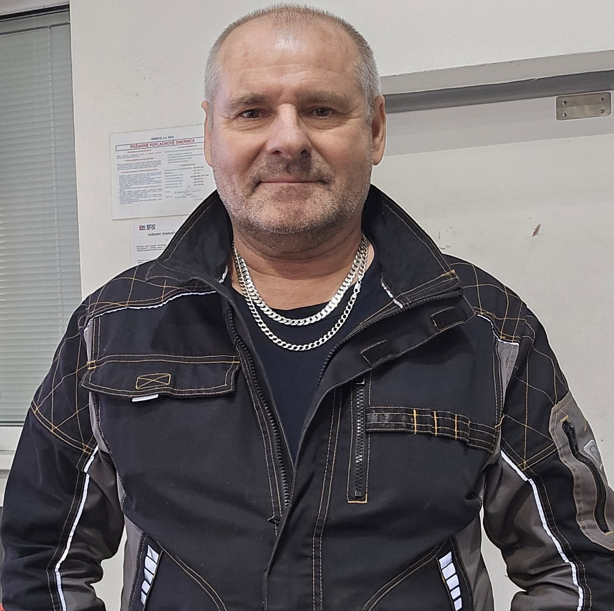

#  František Bubák 

| Field | Value |
|-------|-------|
| ID | 135 |
| Year of birth | None |
| Risk | nizke_stredne |
| Political involvement | siete |
| Active | yes |
| Created | 2026-06-22 16:43:37 |
| Updated | 2026-06-29 14:26:23 |

## Notes

Verejný profil s výraznou proruskou symbolikou a politicko-aktivistickým obsahom. Fotografie s ruskými vlajkami, symbolom dvojhlavého orla a politickými heslami naznačujú otvorenú identifikáciu s proruským naratívom.