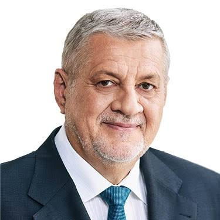

#  Ján Kubiš 

| Field | Value |
|-------|-------|
| ID | 162 |
| Year of birth | 1952 |
| Risk | stredne |
| Political involvement | nie |
| Active | yes |
| Created | 2026-06-30 09:17:42 |
| Updated | 2026-06-30 09:17:42 |

## Notes

V minulosti označil ruskú vojnu za agresiu a podporil pomoc Ukrajine, no v aktuálnej fáze vojny vystupuje v rizikovom diplomatickom rámci: zdôrazňuje rokovania s Ruskom, finančné riziká pomoci Kyjevu, korupciu na Ukrajine a potrebu kontaktov s ruskou stranou. Ako poradca prezidenta sa stretol so Sergejom Lavrovom.