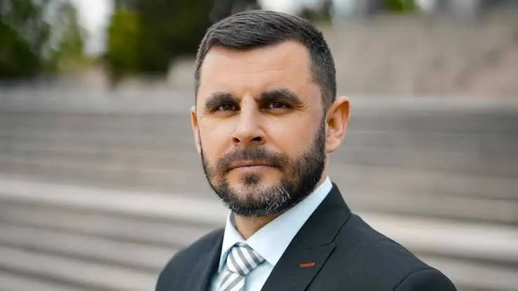

#  Ján Mažgút 

| Field | Value |
|-------|-------|
| ID | 87 |
| Year of birth | 1982 |
| Risk | stredne_vysoke |
| Political involvement | ano |
| Active | yes |
| Created | 2026-06-16 09:59:00 |
| Updated | 2026-06-27 12:22:52 |

## Notes

Slovenský politik pôsobiaci v línii normalizácie vzťahov s Ruskou federáciou, ktorý sa počas ruskej vojny proti Ukrajine zúčastnil parlamentnej návštevy Moskvy a verejne podporoval obnovenie komunikácie s Moskvou.

## Link
https://hlasyagresora.eu/?osoba=87