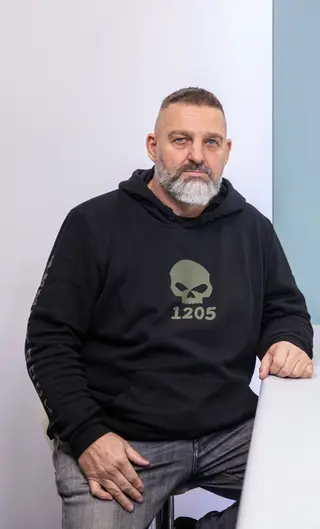

#  Jozef Hambálek 

| Field | Value |
|-------|-------|
| ID | 94 |
| Year of birth | None |
| Risk | stredne_vysoke |
| Political involvement | nie |
| Active | yes |
| Created | 2026-06-16 18:27:33 |
| Updated | 2026-06-27 12:15:20 |

## Notes

Bol zakladateľom slovenskej pobočky proruského motorkárskeho klubu Noční vlci (známeho blízkym vzťahom s Vladimirom Putinom). Na svojom pozemku vybudoval areál s vojenskou technikou, kde prebiehal výcvik.