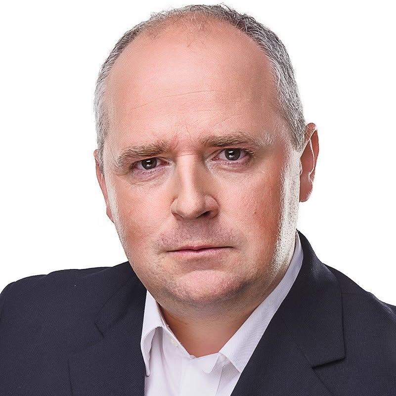

# PhD. Jozef Hrdlička 

| Field | Value |
|-------|-------|
| ID | 102 |
| Year of birth | 1977 |
| Risk | stredne_vysoke |
| Political involvement | nie |
| Active | yes |
| Created | 2026-06-16 18:57:58 |
| Updated | 2026-06-27 12:16:14 |

## Notes

Ako predseda KSS sa pravidelne zúčastňuje na oficiálnych recepciách, spomienkových podujatiach a stretnutiach organizovaných Veľvyslanectvom Ruskej federácie v Slovenskej republike. Udržiava priame vzťahy s ruskými diplomatmi, s ktorými zdieľa pohľady na historické udalosti a geopolitický vývoj.