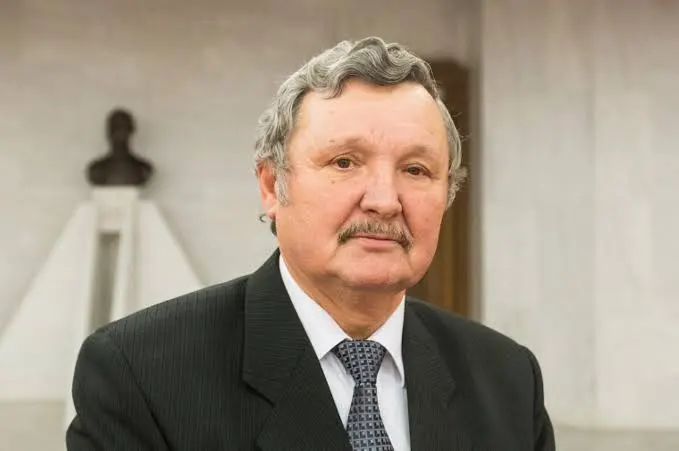

# JUDr. Jozef Šimko 

| Field | Value |
|-------|-------|
| ID | 169 |
| Year of birth | 1951 |
| Risk | stredne_vysoke |
| Political involvement | ano |
| Active | yes |
| Created | 2026-07-04 14:12:54 |
| Updated | 2026-07-04 14:12:54 |

## Notes

Primátor Rimavskej Soboty a bývalý poslanec NR SR. Verejne obhajoval anexiu Krymu, NATO označil za „zločineckú organizáciu“ a opakovane šíril naratívy zhodné s ruskou propagandou. V decembri 2024 prijal na oslavách oslobodenia mesta ruského veľvyslanca Igora Bratčikova.