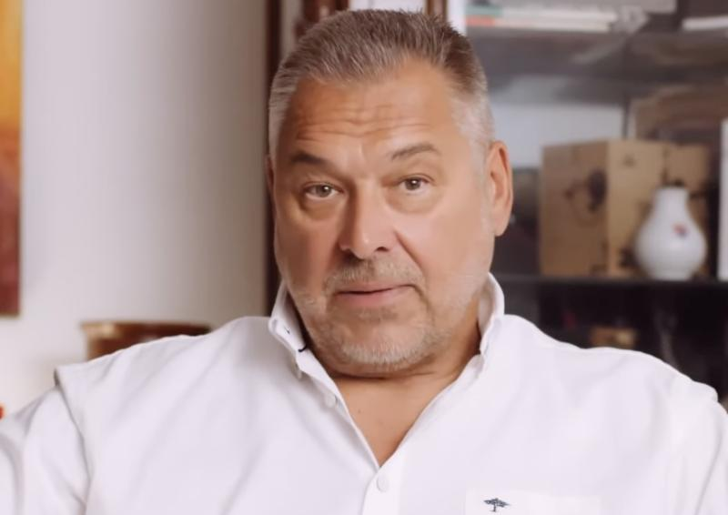

#  Marek Ťapák 

| Field | Value |
|-------|-------|
| ID | 125 |
| Year of birth | 1960 |
| Risk | stredne |
| Political involvement | nie |
| Active | yes |
| Created | 2026-06-21 09:29:08 |
| Updated | 2026-06-28 11:14:36 |

## Notes

Aktívny v alternatívnom/provládnom mediálnom prostredí, v ktorých používa rámce blízke proruskému informačnému priestoru — najmä relativizovanie ruskej agresie, spochybňovanie Ukrajiny ako obete a presúvanie pozornosti na ukrajinský nacionalizmus, Banderu, Šuchevyča či Odesu.