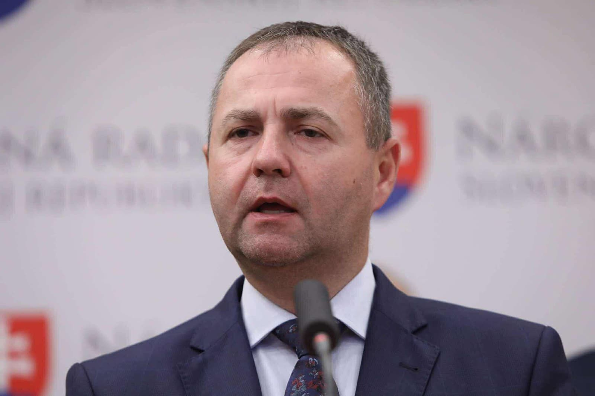

# Mgr. Marián Kéry 

| Field | Value |
|-------|-------|
| ID | 50 |
| Year of birth | 1978 |
| Risk | stredne_vysoke |
| Political involvement | ano |
| Active | yes |
| Created | 2026-06-15 17:22:28 |
| Updated | 2026-06-27 12:18:15 |

## Notes

Slovenský politik pôsobiaci v línii normalizácie kontaktov s Ruskou federáciou, kritizujúci Ukrajinu a sankcie voči Moskve, pričom sa zúčastnil pracovnej návštevy NR SR v Ruskej federácii počas prebiehajúcej ruskej vojny proti Ukrajine.