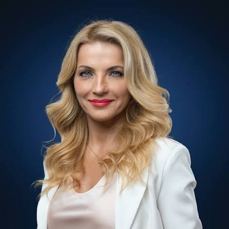

# Mgr. Martina Šimkovičová 

| Field | Value |
|-------|-------|
| ID | 160 |
| Year of birth | 1971 |
| Risk | stredne_vysoke |
| Political involvement | ano |
| Active | yes |
| Created | 2026-06-29 20:16:31 |
| Updated | 2026-06-29 20:16:31 |

## Notes

V minulosti bola spájaná s Televíziou Slovan, označovanou monitoringom dezinformačnej scény za problematický kanál. Ako ministerka v roku 2024 zrušila zákaz komunikácie a spolupráce rezortu kultúry s Ruskom a Bieloruskom, zavedený po začiatku ruskej invázie na Ukrajinu. Riziková je pre vysokú štátnu funkciu, anti-liberálnu kultúrnu politiku a kroky obnovujúce kontakty s Ruskom a Bieloruskom počas vojny.