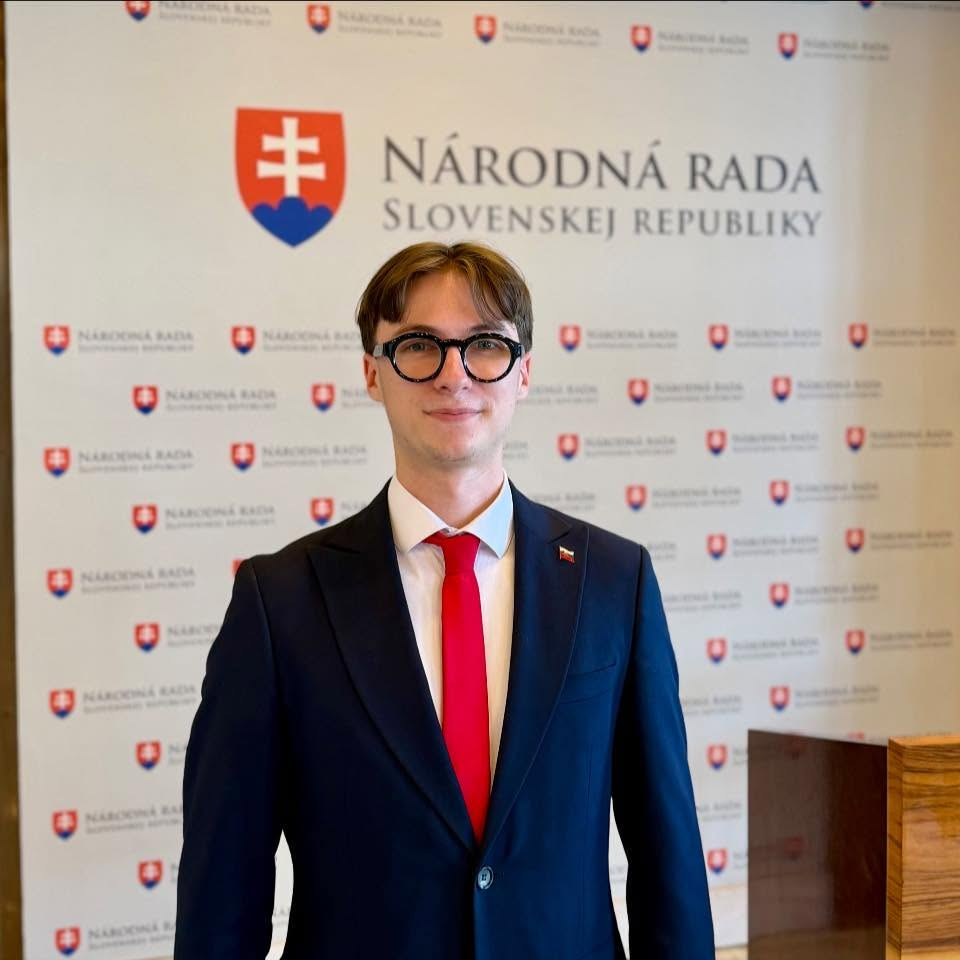

#  Matej Rudnický 

| Field | Value |
|-------|-------|
| ID | 167 |
| Year of birth | None |
| Risk | stredne |
| Political involvement | nie |
| Active | yes |
| Created | 2026-07-01 21:17:40 |
| Updated | 2026-07-01 21:17:40 |

## Notes

Mladý politický aktivista z Banskej Bystrice verejne spojený s prostredím SMER-SD a Mladých sociálnych demokratov. Jeho verejný profil uvádza „MSD | SMER-SD“ a „asistent poslanca NR SR“. Obsahovo komunikuje výrazne pro-SMER a antiopozične. Médiá ho spomínali aj v kontexte diskusie Roberta Fica so študentmi v Poprade a následnej debaty o účasti mladých členov alebo sympatizantov SMER-SD.