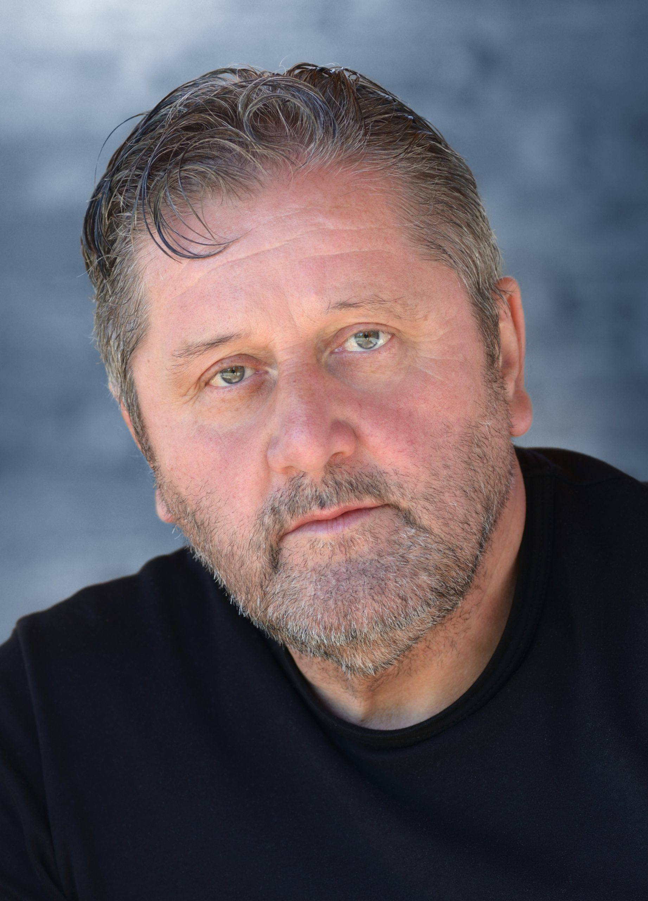

#  Miloš Zverina 

| Field | Value |
|-------|-------|
| ID | 129 |
| Year of birth | None |
| Risk | stredne_vysoke |
| Political involvement | nie |
| Active | yes |
| Created | 2026-06-21 10:10:14 |
| Updated | 2026-06-28 11:15:55 |

## Notes

Zakladateľ a predseda slovanského spolku Slavica, verejne pôsobiaci v témach slovanstva, slovanskej vzájomnosti a kultúrnej identity. V kontexte Ruska je relevantný ako panslavistický a rusofilne orientovaný aktér, ktorý sa objavuje v alternatívnom mediálnom prostredí vrátane Hlavných správ a Zem a Vek.