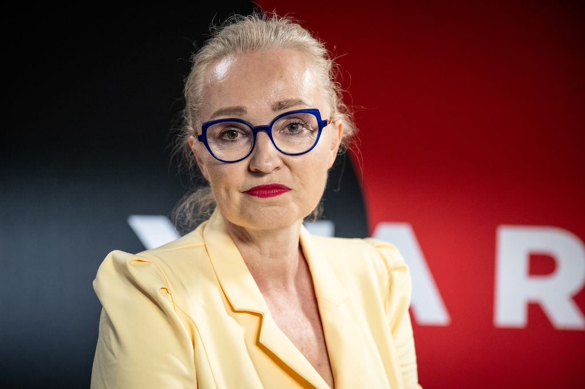

#  Miriam Šramová 

| Field | Value |
|-------|-------|
| ID | 120 |
| Year of birth | 1973 |
| Risk | stredne |
| Political involvement | influencer |
| Active | yes |
| Created | 2026-06-20 13:32:26 |
| Updated | 2026-06-28 11:13:59 |

## Notes

Miriam „Mimi“ Šramová sa v slovenskom mediálnom priestore dlhodobo radí k osobnostiam alternatívnej a dezinformačnej scény, ktoré systematicky preberajú a šíria proruské naratívy a konšpirácie. Vo svojej tvorbe (napr. na kanáloch YouTube a Telegram) nesúhlasí s vojenskou pomocou Ukrajine, spochybňuje kroky západných spojencov a legitimizuje oficiálnu rétoriku Ruskej federácie, respektíve ju prezentuje ako „alternatívny pohľad na pravdu“