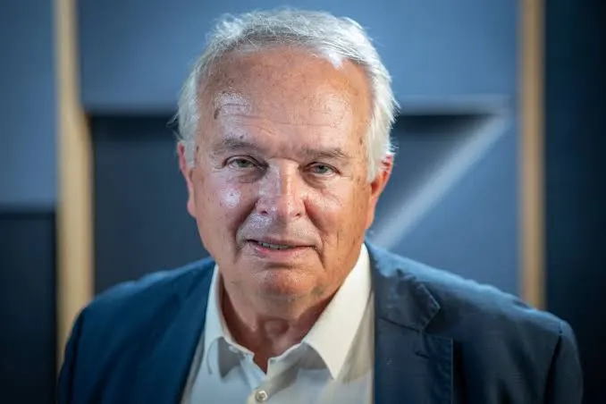

# Judr. Miroslav Radačovský 

| Field | Value |
|-------|-------|
| ID | 59 |
| Year of birth | 1953 |
| Risk | stredne |
| Political involvement | ano |
| Active | yes |
| Created | 2026-06-15 17:57:00 |
| Updated | 2026-06-27 12:26:28 |

## Notes

Slovenský politik šíriaci proruský a protizápadný rámec vojny proti Ukrajine, odmietajúci zbrojnú pomoc Kyjevu a vystupujúci v Európskom parlamente proti politike zodpovednosti voči Ruskej federácii. Systematicky hlasoval proti všetkým európskym rezolúciám, ktoré odsudzovali ruskú agresiu alebo zavádzali ekonomické sankcie.