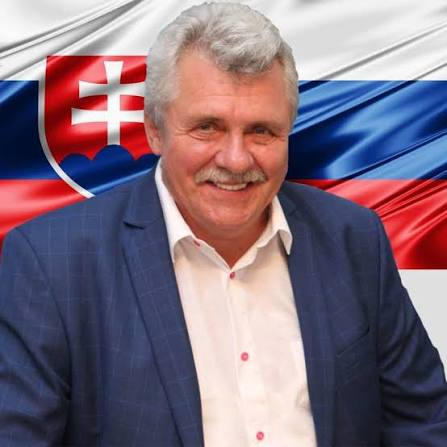

#  Peter Marček 

| Field | Value |
|-------|-------|
| ID | 95 |
| Year of birth | 1953 |
| Risk | vysoke |
| Political involvement | nie |
| Active | yes |
| Created | 2026-06-16 18:32:34 |
| Updated | 2026-06-27 12:22:22 |

## Notes

Priamo na Kryme rokoval s okupačnými predstaviteľmi a podpísal dohodu o vytvorení Európsko-Krymskej obchodnej komory, čím otvorene porušil sankčnú politiku a diplomatickú líniu SR. Položil základy pre legitimizáciu ruských územných ziskov slovenskými politikmi.

## Link
https://hlasyagresora.eu/?osoba=95