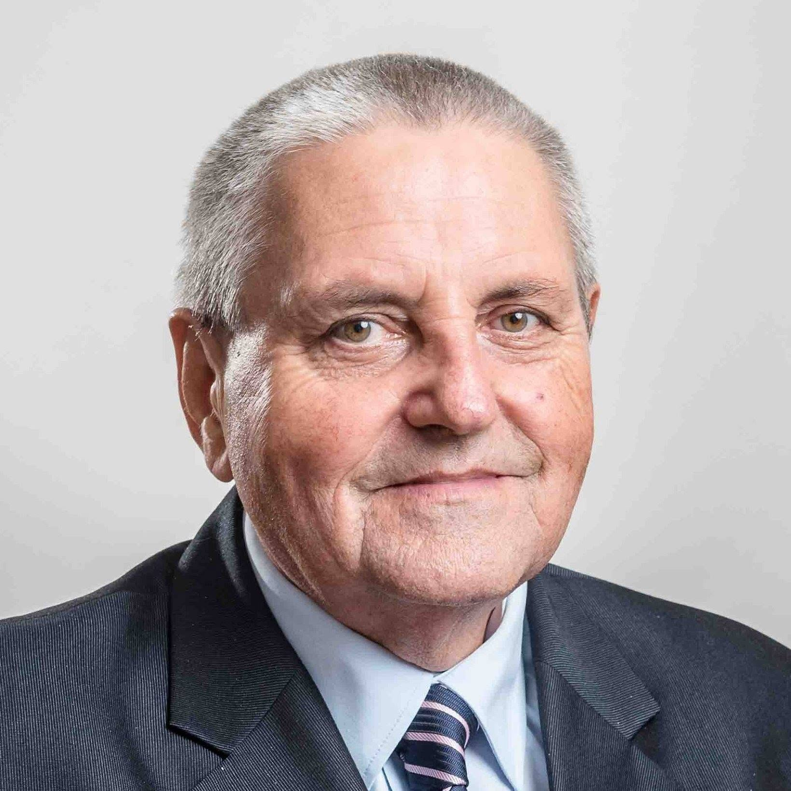

# Mgr. Peter Nišponský 

| Field | Value |
|-------|-------|
| ID | 143 |
| Year of birth | 1952 |
| Risk | stredne |
| Political involvement | nie |
| Active | yes |
| Created | 2026-06-26 18:03:46 |
| Updated | 2026-06-27 11:59:13 |

## Notes

Bývalý príslušník ŠtB evidovaný Ústavom pamäti národa, dlhoročný aktér komunistického prostredia v Košiciach a kandidát KSS. Spájaný so stránkou Komunisti Košice / InternkomKE, ktorá šíri anti-NATO, protiukrajinské a proruské naratívy. V roku 2015 bol podľa médií sekretárom Charty 2015, ktorá spoluorganizovala podporu ruského ministra Sergeja Lavrova na Slavíne.