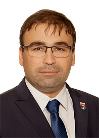

# Ing. Radoslav Vazan 

| Field | Value |
|-------|-------|
| ID | 108 |
| Year of birth | 1977 |
| Risk | stredne_vysoke |
| Political involvement | ano |
| Active | yes |
| Created | 2026-06-16 19:41:18 |
| Updated | 2026-06-28 11:15:08 |

## Notes

Radoslav Vazan opakovane pozýva zástupcov ruského veľvyslanectva na spomienkové akcie pri príležitosti oslobodenia mesta. V tejto tradícii pokračoval aj po vypuknutí konfliktu na Ukrajine, kedy väčšina slovenských miest účasť ruských diplomatov pre agresiu Moskvy zrušila.