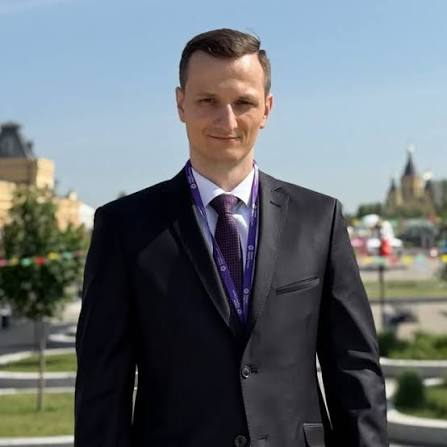

#  Tomáš Špaček 

| Field | Value |
|-------|-------|
| ID | 107 |
| Year of birth | 1996 |
| Risk | stredne_vysoke |
| Political involvement | ano |
| Active | yes |
| Created | 2026-06-16 19:38:16 |
| Updated | 2026-06-28 11:13:45 |

## Notes

Aktívne vyhľadáva priame kontakty s ruskými štátnymi štruktúrami. Ešte ako asistent europoslanca sa v marci 2024 osobne zúčastnil na Svetovom festivale mládeže v ruskom Soči, kde prezentoval politiku Republiky a hovoril o potrebe zastavenia vojenskej pomoci Ukrajine.