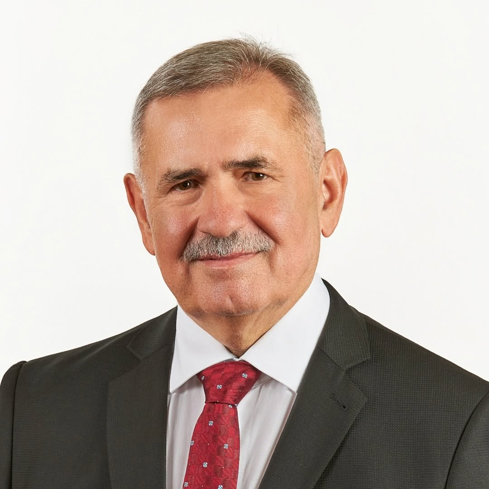

#  Viliam Zahorčák 

| Field | Value |
|-------|-------|
| ID | 155 |
| Year of birth | 1959 |
| Risk | stredne_vysoke |
| Political involvement | ano |
| Active | yes |
| Created | 2026-06-29 16:05:40 |
| Updated | 2026-06-29 16:05:40 |

## Notes

Stabilná postava smeráckeho politického prostredia na Zemplíne. Vystupoval pri straníckej výzve za účasť športovcov z Ruska a Bieloruska na olympiáde, čo zapadá do širšieho smeráckeho rámca relativizovania izolácie Ruska po agresii voči Ukrajine. Jeho pôsobenie v Michalovciach je spájané aj s kauzou MediPark/Bžán, v ktorej sa riešili právne služby za 480 000 eur a ÚVO konštatoval porušenie zákona pri obstarávaní.