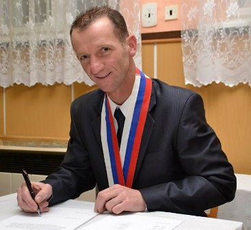

# Bc. Vladimír Baran 

| Field | Value |
|-------|-------|
| ID | 105 |
| Year of birth | None |
| Risk | nizke |
| Political involvement | nie |
| Active | yes |
| Created | 2026-06-16 19:32:17 |
| Updated | 2026-06-27 11:44:22 |

## Notes

Na jeseň 2024 vyhlásil oficiálnu finančnú zbierku určenú pre civilných obyvateľov ruskej Kurskej oblasti, ktorí boli zasiahnutí ukrajinskou protiofenzívou. Zbierku sprevádzala rétorika prevzatá priamo z ruskej propagandy, pričom na webe obce hovoril o „terorizovaní ruských obyvateľov banderovskými potomkami“. V rámci tejto iniciatívy sa vyzbieralo vyše 50-tisíc eur.