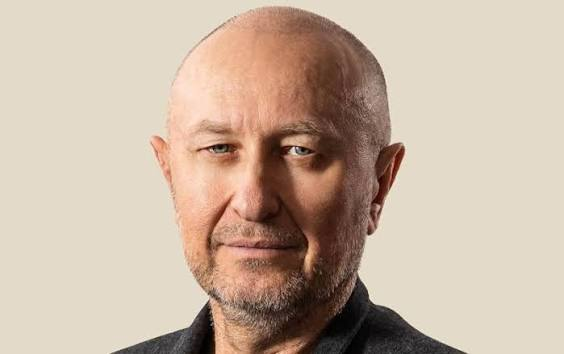

# JUDr. Zoroslav Kollár 

| Field | Value |
|-------|-------|
| ID | 112 |
| Year of birth | 1965 |
| Risk | stredne |
| Political involvement | nie |
| Active | yes |
| Created | 2026-06-17 09:45:06 |
| Updated | 2026-06-27 12:18:29 |

## Notes

Podnikateľ, právnik a predseda strany Právo na pravdu. Verejne vystupuje s antisystémovou, protibruselskou a antiukrajinskou rétorikou. Opakovane kritizuje pomoc Ukrajine, sankcie voči Rusku a politiku EÚ/NATO. Jeho komunikácia obsahuje naratívy blízke proruskému informačnému prostrediu, najmä tvrdenia o škodlivosti protiruských sankcií, zodpovednosti Bruselu za pokračovanie vojny a o údajnom vplyve Ukrajiny na slovenskú politiku.